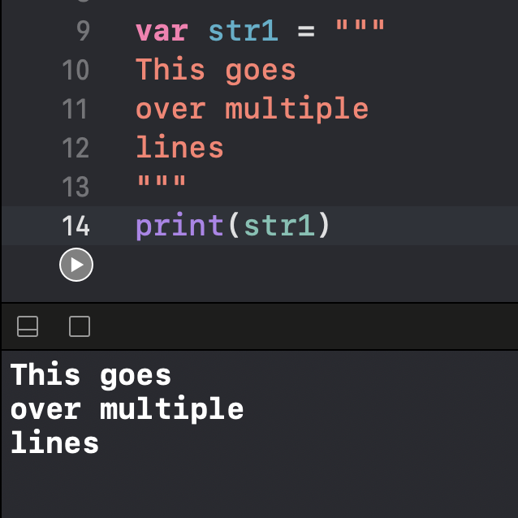
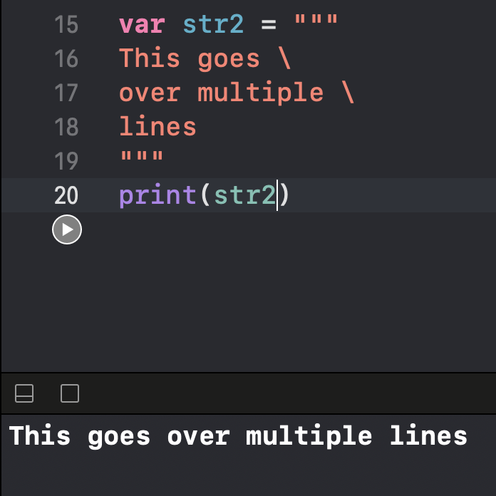
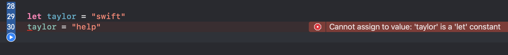
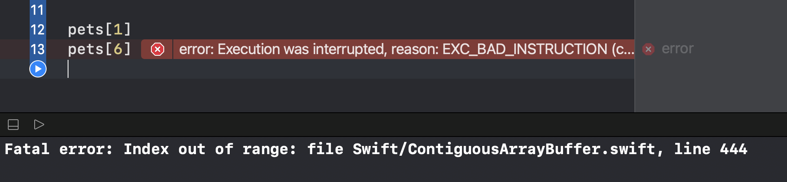
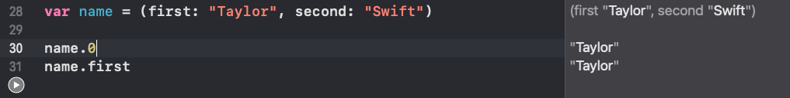

# 100 Days Of SwiftUI

All 100 days will be taken from [Hacking With Swift's 100 Days of SwiftUI](https://www.hackingwithswift.com/100/swiftui)

## Table of Contents

1. [Variables, Simple Data Types, and String interpolation](#1-variables-simple-data-types-and-string-interpolation)
2. [Arrays, Dictionaries, Sets, and Enums ](#2-arrays-dictionaries-sets-and-enums)
3. Conditions
4. Loops

# Days

## 1. Variables, Simple Data Types, and String Intergers

**Date: Jan 2, 2021**

Using Swift Playgrounds, which is my first real time to jump into Swift Playgrounds.

### Variables

Declare variables with `var`
Variables only need to be declared once and the value can be changed just by using the name

```swift
var str = "Hello, playground" // -> Hello, playground
str = "Goodbye" // -> Goodbye
```

### Strings and integers

Swift is a type safe language, which means that each variable has a specific data type. `str` is a String meaning it holds letters

A number for an age can be stored as an `Int` type. If using large numbers in Swift, you can use an `_` as thousands separators and it will not mess up the number.

```swift
var age = 38 // this is an integer aka a type of Int
var population = 8_000_000 // _ can be used as a thousands separator
```

### Multi-line strings

Strings can be declared with double quotes, but by doing that then line breaks cannot be included. For multi-line strings, use triple double quotes, `"""`.

```swift
var str1 = """
This goes
over multiple
lines
"""
```



If formatting across multiple lines, but it is not to be outputted that way, then use a `\`.

```swift
var str2 = """
This goes \
over multiple \
lines
"""
```



### Doubles and Booleans

`Double`s hold decimal numbers like `3.14` or `1.23456781029`.

If declaring a variable with a fractional number (decimal number), then Swift will declare the variable with a `Double` type.

```swift
var pi = 3.14 // type = Double
```

`Boolean`s hold either `true` or `false`.

```swift
var awesome = true // type = Boolean
```

### String interpolation

String interpolation = the ability to put variables into strings

To do this: `\(variable_name)`

```swift
var score = 85
var str = "Your score was \(score)" // Your score was 85
```

### Constants

Used to set a value that never changes and is declared with `let`

```swift
let taylor = "swift" // swift
```

Trying to change the value of a constant will cause an error.



If a variable is declared and the value is not changed, Xcode will produce a warning.

### Type annotations

Swift can infer a type based on what the value assigned to the constant/variable is (type inference).

Sometimes this works, but sometimes being specific would be better or help document what you are expecting the type to be. This is done by `var name: type_name` for a variable or `let name: type_name = value` for a constant.

```swift
let album: String = "Reputation"
let year: Int = 1989
let height: Double = 1.78
let taylorRocks: Bool = true
```

[Back to Table of Contents](#table-of-contents)

## 2. Arrays, Dictionaries, Sets, and Enums

**Date: Jan 3, 2021**

### Arrays

Arrays are collections of data in a specific order and are stored as a single value.

Example of an Array with my pets

```swift
// values for array
let thorgi = "Thorgi Wilson"
let dobby = "Dobby Wilson"
let cairo = "Cairo Wilson"
let sydney = "Sydney Wilson"

// creates the array
let pets = [thorgi, dobby, cairo, sydney]
```

To retrieve a value from the array, the position of the value is needed. Note, the positions for array start at 0.

Example: get the value of `dobby`

```swift
pets[1] // Dobby Wilson
```

If trying to get a value from a position that doesn't exist, then Swift will crash.

If wanting to give a type to the array, put the type annotation in brackets. The image below shows that calling `pets[6]` gives an index out of range error since there are only 4 positions in `pets`.



### Sets

Similar to arrays but have two main differences

1. Items are **not** stored in an order and may be returned in a different order
2. All items must be unique

Create a set by using `Set()` and put a collection of items inside it.

Example:

```swift
let westNHLTeams = Set(["Ducks", "Blackhawks", "Coyotes", "Avalanche", "Flames", "Stars", "Oilers", "Wild", "Kings", "Predators", "Sharks", "Blues", "Canucks", "Jets", "Golden Knights"])
```

If you create a set with duplicate items, then the duplicates get ignored.

```swift
// flames and avalanche are duplicated
let westNHLTwo = Set(["Ducks", "Blackhawks", "Coyotes", "Avalanche", "Avalanche", "Flames", "Flames", "Stars", "Oilers", "Wild", "Kings", "Predators", "Sharks", "Blues", "Canucks", "Jets", "Golden Knights"])

print(westNHLTeams)
// ["Blackhawks", "Predators", "Blues", "Stars", "Kings",
// "Avalanche", "Golden Knights", "Coyotes", "Flames",
// "Sharks", "Oilers", "Wild", "Ducks", "Canucks", "Jets"]

print(westNHLTeamsTwo)
// ["Blackhawks", "Predators", "Blues", "Stars", "Kings",
// "Avalanche", "Golden Knights", "Coyotes", "Flames",
// "Sharks", "Oilers", "Wild", "Ducks", "Canucks", "Jets"]

```

Notice in the two print statements the outputs are the same.

### Tuples

Store a several values in one value. Tuples are different from arrays because

1. Tuples are fixed in size
2. The type of items in a tuple cannot be changed
3. Tuple items can be accessed from name or numerical positions. Swift will not let you read numbers or names that don't exist.

```swift
var name = (first: "Taylor", second: "Swift")

name.0
name.first
```



### When to use each?

Arrays, Sets, and Tpples are a collection of data. Each of them has a specific use case.

- Tuples should be used when each item has a precise position or name
- Sets should be used when every value in the collection is unique
- Arrays should be use when order matters and or you need duplicates
  - Arrays are also the most common data type

### Dictionaries

Collections of calues like arrays.

```swift
let captains = [
    "penguins": "Crosby",
    "wild": "Spurgeon",
    "sharks": "Couture"
]
```

If a key doesn't exist, then you get back nil.

```swift
captains["penguins"] // Crosby
captains["ducks"] // nil
```

Adding a default value to ducks could be easier to know what your return type will be.

```swift
let captains = [
    "penguins": "Crosby",
    "wild": "Spurgeon",
    "sharks": "Couture",
    "ducks": "unknown"
]

captains["penguins"] // Crosby
captains["ducks"] // unknown
```

### Empty Collections

Empty collections can be made by providing type annotations.

```swift
var emptyArray: [String]
var emptyDictionary: [String: Int]
var emptySet = Set<String>()
```

### Enumerations (enums)

Define related values in a way that is easier to use.
Can keep you from using different strings.

```swift
let result1 = "failure"
let result2 = "failed"

enum Result {
    case failure
    case success
}

let result3 = Result.failure
```

`result1`, `result2`, `result3` are failures but because 1 and 2 are different strings it would be hard to check if it failed. By using the enum for `result3`, we can always get the same thing back.

Associated values can also have values attached to each case. This allows for cases to be more specific.

```swift
enum AppleProducts {
    case iPhone(generation: String)
    case laptop(model: String)
}

let maegansPhone = AppleProducts.iPhone(generation: "12 Pro Max")
let katiesLaptop = AppleProducts.laptop(model: "MacBook Pro")

```

Enums can have raw values also which allows them to have more meaning.

```swift
enum Planet: Int {
    case mercury
    case venus
    case earth
    case mars
}
```

Swift will automatically give values starting at 0 because the enum type is `Int`.

```swift
print(Planet.earth.rawValue) // 2
```

If I assign one or more cases a specific value, Swift will generate the rest.

```swift
enum Planet: Int {
    case mercury = 1
    case venus
    case earth
    case mars
}

print(Planet.earth.rawValue) // 3
```

[Back to Table of Contents](#table-of-contents)

## 3. Operators and Conditions

### Operators

Mathematical operators used to perform calculations

`+` adds
`-` subtracts
`*` multiplies
`/` divides
`%` gets remainder value

### Operator Overload

Operator may change based on type of parameters.

`+` can join items like strings or arrays **and** can add two numbers together

Swift is type safe so you can't add a Double to a String

### Compound Operators

AKA shorthand operators.

Performs the operator and then assigns the value.

```swift
var score = 95
score -= 5 // scrore is now 90
```

Works similarly with Strings

```swift
var quote = "Haters gonna hate "
quote += "hate hate hate hate" // quote is now `Haters gonna hate hate hate hate hate`
```

### Comparison Operators

Should work like math.

**Equals**

- `==` checks if the value to the left is equal to the value to the right
- `!=` checks if the two values are not equal

```swift
// Comparison

let homeTeam = 5
let awayTeam = 2

homeTeam == awayTeam // false
homeTeam != awayTeam // true
```

**Comparing values**

Same symbols as math

- `<` less than
- `<=` less than or equal to
- `>` greater than
- `>=` greater than or equal to

```swift
homeTeam < awayTeam // false
homeTeam <= awayTeam // false
homeTeam > awayTeam // true
homeTeam >= awayTeam //true
```

This alwso works with strings

```swift
let homeTeamName = "Penguins"
let awayTeamName = "Wild"

homeTeamName < awayTeamName //true
homeTeamName <= awayTeamName //true
homeTeamName > awayTeamName // false
homeTeamName >= awayTeamName // false

homeTeamName == awayTeamName // false
homeTeamName != awayTeamName // true
```

### Conditions

Can use if and comparisons to output or execute specific code

```swift
let red = 8_000_000
let reputation = 4_500_000

if reputation == red {
    print("red and reputation are the same")
} else if red > reputation {
    print("Red sold more albums")
} else {
    print("Reputation sold more albums")
}

// PRINT -> Red sold more albums
```

Can combine conditions if needed like in age checks

```swift
let age1 = 12
let age2 = 21

if age1 > 18 && age2 > 18 {
    print("Both are over 18")
}
```

**Ternary Operator**

Rarely used operator that uses 3 values at once.

1st value = condition
2nd value = something when condition is true
3rd value = something when condition is false

Written like this: `condition ? true : false `

```swift
print(red > reputation ? "Red sold more albums" : "Reputation sold more albums")
// Red sold more albums
```

### Switch Statements

Switch statemens can be used for conditions also, and might be a cleaner way to construct them.

```swift
let album = "Fearless"
switch album {
case "Fearless":
    print("\(12_000_000)")
case "Red":
    print("\(red)")
case "Reputation":
    print("\(reputation)")
default:
    print("UNKNOWN ALBUM no sales available")
}
```

This is cleaner to read than the if else statements.

### Range Operators

Two ways to make a range

- `..<` creates a range that excludes the final value
- `...` creates a range that includes the final value

```swift
0..<4 // 0, 1, 2, 3
0...4 // 0, 1, 2, 3, 4
```

Useful in switches

```swift
let lover = 3_200_000

switch lover {
case 0..<1_000:
    print("Not enough sold")
case 1_000..<3_200_000:
    print("Not enough sold")
case 3_200_000..<4_000_000:
    print("Just enough sold")
default:
    print("Too many album sales")
}
// Just enough sold
```

Way easier to do a range than an individual case for each integer.

## Loops

**Date: Jan 5, 2020**

### For Loops

Most common type. Used to iterate over objects in arrays and ranges. Each time the loop iterates, then one item is pulled and assigned to a constant to be used in the loop.

```swift
// Number example

let count = 1...5
for number in count {
  print("number is \(number)")
}
/*
1
2
3
4
5
*/

// Array example
let westNHLTeams = ["Ducks", "Blackhawks", "Coyotes", "Avalanche", "Flames", "Stars", "Oilers", "Wild", "Kings", "Predators", "Sharks", "Blues", "Canucks", "Jets", "Golden Knights"]

for team in westNHLTeams {
    print("team is \(team)")
}
/*
team is Ducks
team is Blackhawks
team is Coyotes
team is Avalanche
team is Flames
team is Stars
team is Oilers
team is Wild
team is Kings
team is Predators
team is Sharks
team is Blues
team is Canucks
team is Jets
team is Golden Knights
*/
```

If the constant isn't needed in the loop, use an `_` to ignore it.

```swift
print("Players gonna ")

for _ in 1...5 {
    print("play")
}
/*
Players gonna
play
play
play
play
play
/*
```

### While Loops

While loops run until a condition fails.

```swift
var number = 1

while number <= 20 {
    print(number)
    number += 1
}

print("Ready or not, here I come!")
```

### Repeat Loop

Like a while loop, but the condition to check comes at the end

Code inside loop will run at least once where as in a while loop the loop might never run.

```swift
number = 1

repeat {
    print(number)
    number += 1
} while number <= 20

print("Ready or not, here I come!")
```

### Exiting Loops

Use `break` to exit a loop at any time.

```swift
while timesThorgiShouldEat >= 0 {
    print(timesThorgiShouldEat)

    if timesThorgiShouldEat == 2 {
        print("Thorgi is on a diet")
        break;
    }

    timesThorgiShouldEat -= 1
}
```

Breaking out of nested loops is possible if the outer loop has a label.

```swift
outerLoop: for i in 1...10 {
    for j in 1...10 {
        let product = i * j
        print ("\(i) * \(j) is \(product)")

        if product == 50 {
            print("It's a bullseye!")
            break outerLoop
        }
    }
}
```

### Skip items

Use continue to skip items

```swift
for i in 1...10 {
    if i % 2 == 1 {
        continue // skips odds
    }
    print(i)
}
```

### Infinite Loops

All apps use infinite loops to continually watch.

Use `true` to cause an infinite loop.

```swift
var counter = 0
while true {
    print("Hi")
    counter += 1

    if counter == 27 {
        break
    }
}
```

If doing this on purpose, make sure there is a way to break out of the loop at some point.

## Functions, Parameters, and Errors

**Date January 7, 2020**

### Functions

Start with `func` to tell swift that a function is happening, then you need a name and then code inside brackets.

Call the function by functionName and `()`

```swift
func didMyTeamWin(){
    let decision = false;
    if decision == true {
        print("YES, the team won!")
    } else {
        print("NO, the team lost :(")
    }
}

didMyTeamWin()
```

Make function more useful by adding in parameters.

```swift
func didMyTeamWin(teamWon: Bool){
//    let decision = false;
    if teamWon == true {
        print("YES, the team won!")
    } else {
        print("NO, the team lost :(")
    }
}

didMyTeamWin(teamWon: true)
```

---

Well I forgot to take notes for days 5 through 8, so here is Day 9!

## Day 9: Structs Part 2
